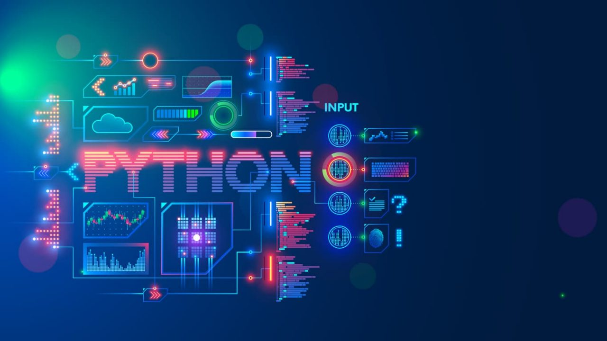

# CURSO DE PYTHON DE PLATZI - DE BÁSICO A AVANZADO

## 

**01** **Curso Básico de Python**

- Operadores.
- Variables.
- Tipos de datos.
- Convertir un tipo de dato a otro.
- Operadores lógicos.
- Condicionales.
- Funciones.
- palíndromos.

**02** **Curso Intermedio de Python**

**03** **Curso Profesional de Python**
